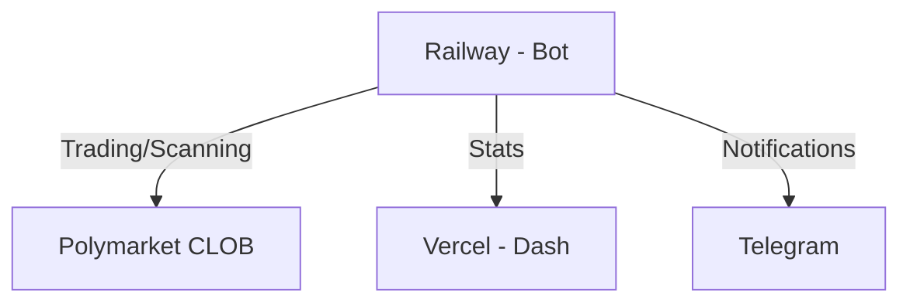

# Polymarket Arbitrage Bot: Lessons Learned & Strategy Retrospective

## 1. Introduction
Prediction markets like Polymarket offer unique opportunities for algorithmic trading. Unlike traditional financial markets, prediction markets have bounded outcomes (probabilities must sum to 1), defined resolution times, and often exhibit pricing inefficiencies due to retail-dominated order flow.

Our goal was to build a profitable automated trading system that could:
1. Identify market inefficiencies
2. Execute trades with proper risk management
3. Operate 24/7 with minimal intervention
4. Track performance and adapt strategies

The bot was built using TypeScript/Node.js, deployed on Railway (backend) and Vercel (dashboard), with real-time notifications via Telegram.

## 2. Strategy Overview
We implemented four strategies, listed in order of development:

| Strategy | Type | Status | Performance | Notes |
| :--- | :--- | :--- | :--- | :--- |
| Crypto 15-Min | Directional | Disabled | -37.81% | Original approach, $5 bets |
| Conservative Scanner | Multi-tier | Disabled | N/A | Four opportunity types |
| CEX Momentum | Directional | Disabled | Paper only | API price mismatch in live |
| Bregman Arbitrage | Market-neutral | Active | N/A (risk-free) | Current focus |

## 3. Strategy 1: Crypto 15-Minute UP/DOWN
### 3.1 Concept
Polymarket offers 15-minute prediction markets on whether crypto assets (BTC, ETH, SOL, XRP) will go UP or DOWN. The strategy entered positions in the final 60 seconds before market close, betting on outcomes trading in a specific price range ($0.80-$0.99).

### 3.2 Implementation
```javascript
// Key parameters
MIN_ENTRY_PRICE: 0.80    // Only enter above 80¢
MAX_ENTRY_PRICE: 0.99    // Only enter below 99¢
ENTRY_WINDOW: 60 seconds // Last minute before close
MAX_SPREAD: 3%           // Maximum market spread
```

### 3.3 Risk Management
- Maximum 4 consecutive losses before halting
- 10% daily stop-loss limit
- Position sizing based on balance percentage

### 3.4 Results & Why It Failed
**Live Trading Results:**
- Return: -37.81%
- Trade size: $5 per bet
- Strategy was tested with real money

This strategy was our first attempt and resulted in significant losses. Key issues:
1. **No edge identification:** Entering based on price range alone doesn't provide predictive value
2. **Adverse selection:** Markets trading at 95¢ YES are likely priced correctly—the market knows something
3. **Spread costs:** 3% spreads eat into already thin margins
4. **No momentum signal:** Random entry timing means we're essentially gambling
5. **Negative expected value:** Without an information edge, the house spread guarantees losses over time

**Conclusion:** Disabled after losing 37.81% of allocated capital. The strategy had no theoretical edge—it was simply betting on high-probability outcomes without accounting for the fact that prices already reflect those probabilities.

## 4. Strategy 2: Conservative Scanner
### 4.1 Concept
A multi-tier opportunity detection system that ranked opportunities by risk level:
- **Tier 1 - Pure Arbitrage:** Buy both YES+NO when sum < $1.00 (zero risk)
- **Tier 2 - High Confidence:** Events with 95%+ probability trading below $0.93
- **Tier 3 - Resolution Arbitrage:** Resolved markets with pending settlement
- **Tier 4 - Price-Verified:** Crypto threshold markets validated against CEX prices

### 4.2 Implementation
```javascript
// Key parameters
minArbitrageProfit: 1%        // Minimum profit for Tier 1
minConfidenceLevel: 95%       // Tier 2 threshold
maxConfidencePrice: $0.93     // Maximum price for high-confidence
maxDailyTrades: 10            // Risk limit
maxPositionPct: 5%            // Per-trade sizing
maxMarketDays: 30             // Only near-term markets
```

### 4.3 Features
- Integration with luzia.dev and CoinGecko for real-time price feeds
- Dual-leg execution protection (auto-sell if one leg fails)
- Volume filtering (skip markets with <$100 volume)
- Telegram alerts for all opportunities

### 4.4 Results & Lessons Learned
**What Worked:**
- Tier 1 (pure arbitrage) concept was sound
- Price-verified opportunities showed promise for crypto threshold markets
- Risk management prevented catastrophic losses

**What Didn't Work:**
- Arbitrage opportunities were rare (efficient markets)
- High-confidence markets often had hidden information
- Resolution arbitrage windows were too short
- Manual tier classification was inflexible

**Why Replaced:** The Bregman strategy offered a more mathematically rigorous approach to arbitrage detection with better optimization.

## 5. Strategy 3: CEX Momentum Strategy
### 5.1 Concept
Exploit the lag between centralized exchange (Binance) price movements and Polymarket 15-minute prediction market pricing. When momentum is detected on CEX, bet on the corresponding Polymarket outcome before the market adjusts.

### 5.2 The Hypothesis
If BTC pumps 0.2% on Binance, the Polymarket "BTC UP" market should follow—but with a delay. By detecting momentum early, we can enter at favorable prices.

### 5.3 Implementation Evolution
We iterated through four versions, each adjusting key parameters:

| Version | Momentum Threshold | Min Edge | Max Entry Price | Result |
| :--- | :--- | :--- | :--- | :--- |
| v1 | 0.3% | 5% | $0.65 | Baseline: 36.7% win rate |
| v2 | 0.8% | 15% | $0.50 | Too strict, no trades |
| v3 | 0.5% | 10% | $0.55 | Low volatility = no signals |
| v4 | 0.2% | 8% | $0.58 | More trades, similar win rate |

### 5.4 Core Logic
```javascript
// Momentum calculation (2-minute lookback)
const momentum = (currentPrice - priceHistory[0]) / priceHistory[0];

// Signal conditions
if (momentum > MOMENTUM_THRESHOLD &&
    entryPrice < MAX_ENTRY_PRICE &&
    expectedValue > MIN_EDGE &&
    timeToClose > 30 && timeToClose < 600) {
  generateSignal();
}
```

### 5.5 Results & Analysis
**Paper Trading Performance:**
- Win rate: ~36.7% across all versions (in simulation)
- Momentum range observed: -0.18% to +0.24%
- Many signals filtered out by liquidity/spread checks
- Paper P&L showed promising results

**Live Trading Reality: Complete Failure**
When we transitioned from paper trading to live execution, we discovered a critical flaw: **The strategy only generated "fantasy profits" due to API price mismatch.**

The issue: We were using two different price sources:
1. **Gamma API (for signal generation):** Provided bid prices
2. **CLOB API (for execution):** Required ask prices

In paper trading, we calculated profits using Gamma API bid prices. But in live trading, actual execution happens at CLOB ask prices—which were significantly different. The result:
- **Paper mode:** Showed profitable signals
- **Live mode:** Orders couldn't fill at expected prices, or filled at much worse prices
- **Actual trades:** Failed to execute due to price mismatch

**Why It Really Failed:**
1. **API Price Discrepancy:** Bid vs. ask price difference made all "opportunities" disappear when actually trying to execute
2. **Fantasy Backtesting:** Paper trading validated against the wrong price feed, giving false confidence
3. **Insufficient Edge:** Even if prices matched, 36.7% win rate requires >2.7x payout to break even
4. **Momentum Decay:** By the time momentum was detected, the market had already adjusted
5. **Adverse Selection:** When momentum was strong enough to trigger a signal, market makers had already repriced

**Key Insight:** Paper trading is only as good as your price simulation. Using bid prices for paper P&L while live execution uses ask prices will always show phantom profits. This was an expensive lesson in the importance of realistic backtesting.

## 6. Strategy 4: Bregman Projection Arbitrage (Current Focus)
### 6.1 Theoretical Foundation
This strategy is based on the mathematical insight that prediction market prices should form valid probability distributions. When they don't, arbitrage opportunities exist.

Key Concepts:
1. **Probability Simplex:** Prices should sum to 1 (for mutually exclusive outcomes)
2. **Bregman Divergence:** Measures "distance" from valid probability distribution
3. **KL-Divergence:** $D(\mu||\theta) = \sum \mu_i \log(\mu_i/\theta_i)$ quantifies mispricing
4. **Frank-Wolfe Algorithm:** Efficiently finds optimal trade allocation

### 6.2 Arbitrage Types Detected
1. **Simple Arbitrage:** Binary markets where YES + NO < $1.00
2. **Multi-Outcome Arbitrage:** Markets with >2 outcomes not summing to $1.00
3. **Cross-Market Arbitrage:** Related markets with logical constraints

### 6.3 Implementation
```javascript
// Frank-Wolfe optimization
for (let iter = 0; iter < MAX_ITERATIONS; iter++) {
  const gradient = computeGradient(current, marketPrices);
  const vertex = argmin(gradient); // Simplex vertex
  const stepSize = 2 / (iter + 2);
  current = (1 - stepSize) * current + stepSize * vertex;

  if (converged(current, previous)) break;
}

// Key parameters
MIN_PROFIT_PCT: 0.5%      // Minimum profit margin
MIN_PROFIT_USDC: $0.50    // Minimum absolute profit
MAX_SLIPPAGE: 5%          // Slippage tolerance
MAX_POSITION_SIZE: 10%    // Per-arbitrage sizing
```

### 6.4 Execution Safeguards
- **VWAP Analysis:** Uses volume-weighted average price for realistic execution
- **Orderbook Verification:** Validates liquidity before execution
- **Hedge Mechanism:** Auto-sells failed leg to limit losses
- **Paper Trading Mode:** Validates strategy before live deployment

### 6.5 Current Status
The strategy is running in paper trading mode, scanning markets every 30 seconds. Early results show:
- Markets scanned: ~500 per cycle
- Arbitrage opportunities: Rare but high-confidence when found
- Paper P&L tracking enabled

### 6.6 Why This Approach is Promising
1. **Mathematical Rigor:** Based on convex optimization theory with convergence guarantees
2. **Risk-Free by Definition:** True arbitrage has no directional risk
3. **Market-Neutral:** Profitable regardless of outcome
4. **Scalable:** Algorithm complexity is $O(n^2)$ for $n$ outcomes

## 7. Technical Infrastructure
### 7.1 Architecture


### 7.2 Key Components
- **Trading Engine:** Orchestrates all strategies, manages state
- **Polymarket Client:** CLOB API integration with signature handling
- **Dashboard:** Real-time monitoring (Next.js 14)
- **Telegram Service:** Trade notifications and alerts

### 7.3 Deployment
- **Backend:** Railway (continuous deployment from main branch)
- **Frontend:** Vercel (Next.js static export)
- **Configuration:** Environment variables for all secrets

## 8. Lessons Learned
### 8.1 What Worked
1. **Comprehensive Logging:** Detailed logs helped diagnose issues
2. **Modular Architecture:** Easy to add/disable strategies
3. **Real-time Dashboard:** Visual monitoring caught issues early
4. **Risk Limits:** Daily limits and consecutive loss stops prevented total blowups
5. **Small Position Sizing:** $5 bets limited losses during strategy validation

### 8.2 What Didn't Work
1. **Paper Trading with Wrong Prices:** Using Gamma API (bid) for PnL while execution uses CLOB (ask) creates "fantasy profits".
2. **Directional Strategies:** Lost 37.81% on crypto 15-min strategy. Without alpha, you're just paying the spread.
3. **Momentum Strategies:** Edge decays faster than execution.
4. **Simple Heuristics:** Price-range based entry has no predictive value—it's gambling with extra steps.
5. **Manual Tuning:** Constant parameter tuning indicates an absence of genuine edge.

### 8.3 Key Insights
> "In prediction markets, if you can easily see the opportunity, so can everyone else."
> "Paper trading is only as good as your price simulation. Fantasy profits from mismatched price feeds teach you nothing."
> "A strategy that loses 37.81% is giving you valuable information: you have no edge. Listen to it."

Stable edge comes from exploiting structural inefficiencies (mathematical), not information asymmetries (directional bets).

## 9. Future Research Directions
### 9.1 Near-Term Improvements
- Live Bregman Execution
- Cross-Market Detection
- Latency Optimization
- Orderbook ML

### 9.2 Potential New Strategies
- **Market Making:** Provide liquidity and earn spread (Inventory Risk)
- **Event-Driven:** Trade around scheduled events
- **Sentiment Analysis:** Social media signals
- **Cross-Platform Arbitrage:** Polymarket vs. Kalshi vs. PredictIt
- **Options Replication:** Synthetic options via prediction market positions

### 9.3 Infrastructure Improvements
- **Backtesting Framework:** Historical data replay
- **A/B Testing:** Parallel strategy runs
- **Auto-Tuning:** Bayesian optimization
- **Risk Dashboard:** Real-time VaR and drawdown monitoring

## 10. Conclusion
Building a profitable prediction market trading bot is harder than it appears. The market is more efficient than casual observation suggests. 

Sustainable edge comes from exploiting structural inefficiencies, as reflected in our evolution from directional strategies to the current Bregman Arbitrage focus.
